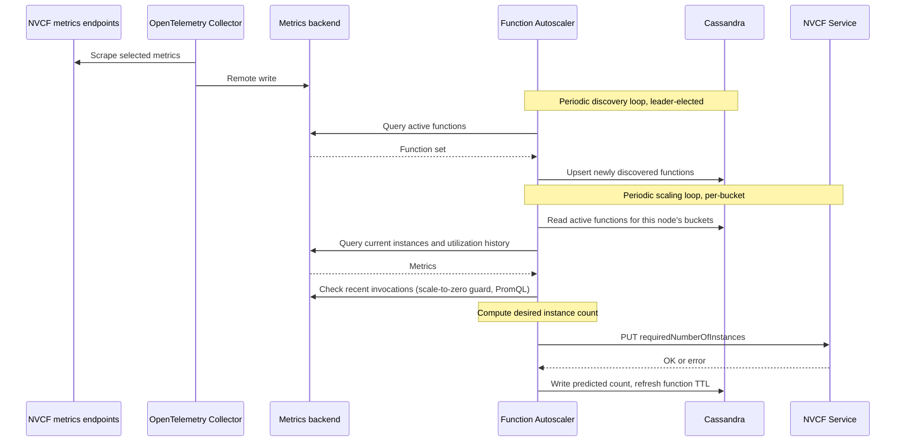

# Function Autoscaler Architecture

The Function Autoscaler runs as a Kubernetes Deployment in the control-plane
cluster. It reads metrics from a PromQL-compatible backend, stores coordination
state in Cassandra, and writes desired instance counts to the NVCF API.

The work is split into two loops. A leader-elected discovery loop scans the
timeseries database for active function versions and upserts them into
Cassandra. A scaling loop runs on every replica, but each replica only handles
the functions whose IDs hash into its assigned buckets, so the active set is
sharded across replicas.

## Sequence Diagram

The discovery loop runs on one leader-elected replica. The scaling loop runs on
every replica, but each replica only processes its assigned function buckets.

## Deployment order

With the default `control` profile, the observability stage installs Prometheus
Operator CRDs, the OpenTelemetry Operator, an OpenTelemetry Collector with
Target Allocator and discovery RBAC, control-plane monitors, and VictoriaMetrics.
The final stage installs State Metrics, then the Function Autoscaler. State
Metrics is the autoscaler's install-order dependency. At runtime, the autoscaler
also requires Cassandra, the NVCF API, and a reachable PromQL backend.

The shared metrics stage is skipped for `disabled`. The Function Autoscaler is
installed only for `control` and `all`.

## Metrics backend

The autoscaler is a read-only client of a PromQL-compatible backend. It uses
range queries to discover active functions and read instance, request, and
utilization metrics.

The autoscaler does not scrape metrics. It selects a metric source for each
function, and the metrics for that source must reach the backend that it
queries. The sources are alternatives, not a single required set:

| Metric source | Inputs |
| --- | --- |
| Worker threads | Worker thread count and busy time, plus invocation activity |
| LLM API Gateway | Request count and duration, plus State Metrics instance, concurrency, and function metadata |
| Control plane | Request latency and activity, plus State Metrics instance and concurrency data |

If worker metrics are unavailable, the autoscaler can use LLM Gateway or
control-plane metrics when the required inputs are present.

For a split deployment, the compute-plane profile enables the NVCA collector but
does not automatically route worker metrics to the control-plane backend.
Configure the compute-plane exporter to send worker metrics to the backend
queried by the autoscaler, or use a backend reachable from both planes. See
[Cluster Monitoring](../cluster-management/monitoring.md) for compute-plane
metrics endpoints.

The backend can be bundled VictoriaMetrics or an existing PromQL-compatible
service. See [Observability Configuration](../observability.md) for backend,
endpoint, and authentication settings.

The autoscaler reports `not ready` until the query endpoint responds.

## Coordination and Self-Healing

Coordination relies on Cassandra TTLs to recover from failures without operator intervention:

- The discovery lock self-expires if the leader replica crashes or is partitioned, so a new leader takes over on the next loop iteration.
- Bucket ownership is recomputed when replicas join or leave. During a reshuffle a function may be skipped for a single scaling cycle or briefly picked up by a different replica, and a short-lived per-function lock prevents two replicas from racing on the same function in that window.
- Each active function row carries a TTL refreshed by every scaling cycle, so functions that stop emitting metrics age out of the active set automatically.

## See Also

- [Configure Autoscaling](../configure-autoscaling.md) for setting per-function scaling bounds, factors, thresholds, and stickiness via the NVCF API.
- [Function Autoscaler Operations](./operations.md) for health endpoints and common issues.
- [Function Autoscaler Observability](./observability.md) for emitted metrics, traces, and logs.
- [Observability Configuration](../observability.md) for profiles and metrics backend settings.
